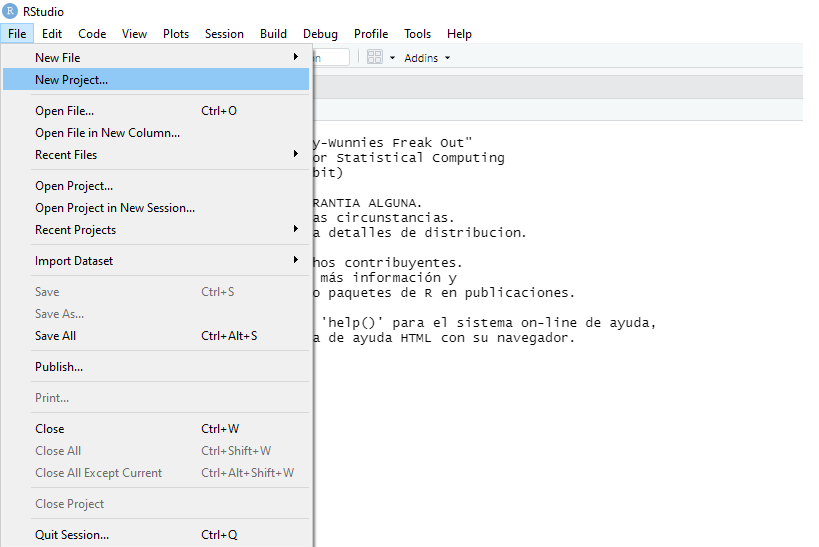
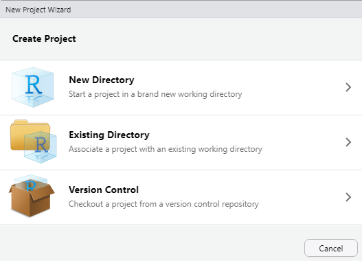

```{r include=FALSE}
options(tibble.width = NULL)
```


```{r xaringanExtra-clipboard, eval=FALSE, include=FALSE}
htmltools::tagList(
 xaringanExtra::use_clipboard(
   button_text = "<i class=/"fa fa-clipboard/"></i>",
   success_text = "<i class=/"fa fa-check/" style=/"color: #90BE6D/"></i>",
 ),
 rmarkdown::html_dependency_font_awesome()
)
```

```{r xaringan-extra-styles, echo=FALSE}
##These are the defaults
xaringanExtra::use_extra_styles(
  hover_code_line = TRUE,         #<<
  mute_unhighlighted_code = TRUE
)
```

```{r xaringanExtra-scribble, echo=FALSE}
#xaringanExtra::use_scribble()
```


<style type="text/css">
.remark-slide-content {
    font-size: 25px;
    padding: 1em 1em 1em 1em;
}
</style>


```{r, include = F}
# This is the recommended set up for flipbooks
# you might think about setting cache to TRUE as you gain practice --- building flipbooks from scratch can be time consuming
knitr::opts_chunk$set(fig.width = 10, message = FALSE, warning = FALSE, comment = "", cache = F)

#devtools::install_github("gadenbuie/countdown")
library(countdown)
library(flipbookr)
library(tidyverse)
library(xaringanthemer)
library(xaringan)
library(gt)
library(icons)
library(here)
```


# Hoja de ruta


<br><br>

## ✔️ Paquetes

## ✔️ Lectura / escritura de archivos

## ✔️ Proyectos


---
class: inverse, middle, center


# Paquetes

<html>  <div style='float:left'></div>  <hr color='#EB811B' size=1px width=1125px></html>


---
# Paquetes

### Con R podemos aumentar las funciones para realizar operaciones a través de los **paquetes**.

```{r echo=FALSE, out.height = 500, out.width = 800}
#knitr::include_graphics(here("img", "R5.PNG"))
knitr::include_graphics("../img/R5.PNG")
```


---
# Paquetes


.pull-left[


### Para poder usar un paquete, primero debemos __instalarlo__:

```r

`install.packages("nombre_del_paquete")`

```

]

--

.pull-right[


### Cada vez que queremos utilizar una función del paquete, debemos __convocarlo__:

```r

`library(nombre_del_paquete)`

```
    
]


---
class: inverse, middle, center

# Lectura / importación de datos

***

---
# Lectura / importación de datos

## R base tiene una función para cada extensión de archivo:

<br><br>

- `read.table()` --> _.txt_

- `read.csv()` --> _.csv_

- `readRDS()` --> _.rds_


---
# Lectura / importación de datos

## Pero... ¿no están todas, no?

--

### Para ello, instalaremos algunos paquetes que nos permiten incorporar más funciones para leer más tipos de datos. 

Por ejemplo, el paquete `haven` incorpora:


- `read_sas()` --> _.sas (SAS)_

- `read_spss()` --> _.sav (SPSS)_

- `read_stata()` --> _.dta (STATA)_


--

y el paquete `readxl`:

- `read_xlsx()` --> _.xlsx (Excel)_

---
# Lectura / importación de datos


### Supongamos que descargo la base de datos de registros de certificados [CUIDAR-VERANO](http://datos.yvera.gob.ar/dataset/certificado-unico-habilitante-para-circulacion-cuhc---verano) en formato separado por comas (_.csv_) y la quiero importar con R.

--

### la función que me permite importar una base de datos de tipo _.csv_ se llama `read.csv()`:

```r
base_cuidar <- read.csv(
  file = "C:/Users/pablo/Desktop/proyecto_cuidar/entradas/certificados-personas-por-fecha-ingreso.csv",
  header = TRUE, 
  sep = ",", 
  dec = ".")

```

---
# Lectura / importación de datos


- A tener en cuenta respecto a la ruta donde se ubica el archivo:


```r
base_cuidar <- read.csv(
  'file = "C:/Users/pablo/Desktop/proyecto_cuidar/entradas/certificados-personas-por-fecha-ingreso.csv",'
  header = TRUE, 
  sep = ",", 
  dec = ".")
```

--

- Si se la compartimos a otra persona, __se rompe__
    
- Si cambiamos de computadora, __se rompe__
    
- Si lo cambiamos de lugar, __se rompe__
   
---
class: inverse, center, middle

```{r echo=FALSE, out.height = 500, out.width = 800}
knitr::include_graphics("../img/tomy hanky.gif")
```

---
class: inverse, center, middle

```{r echo=FALSE, out.height = '50%'}
knitr::include_graphics("../img/Rproject.png")
```

---
# Proyectos y rutas de trabajo


.pull-left[

#### Paso 1:

```{r echo=FALSE}
#knitr::include_graphics(here("img", "nuevo_proyecto.png"))

```

]

.pull-right[

#### Paso 2:

```{r echo=FALSE}
#knitr::include_graphics(here("img", "nuevo_proyecto_1.png"))

```

]


---
# Proyectos y rutas de trabajo


.pull-left[

#### Paso 3:

```{r echo=FALSE}
#knitr::include_graphics(here("img", "nuevo_proyecto_2.png"))
knitr::include_graphics("../img/nuevo_proyecto_2.png")
```

]

.pull-right[

#### Resultado:

```{r echo=FALSE, fig.align='center'}
#knitr::include_graphics(here("img", "proyecto_nuevo.png"))
knitr::include_graphics("../img/proyecto_nuevo.png")
```

]

---
# Proyectos y rutas de trabajo


### Armando un proyecto con Rstudio, la función se escribiría de esta forma:

```r
base_cuidar <- read.csv(
  'file = "entradas/certificados-personas-por-fecha-ingreso.csv",'
  header = TRUE, 
  sep = ",", 
  dec = ".")
```

--

### Ventajas: 

    - Le indicamos a R dónde "vive" nuestra carpeta de trabajo

    - La ruta ya no contiene ninguna referencia personal que impida ser abierto en otra computadora


---
class: inverse, middle, center

```{r echo=FALSE, out.height = 500, out.width = 800}

```


---
# Proyectos y rutas de trabajo

### Supongamos que queremos comenzar un nuevo proyecto para analizar el conjunto de certificados solicitados para vacacionar durante la temporada verano del año 2021

--

#### El flujo de trabajo sería el siguiente:


1) Armo la carpeta del proyecto, por ejemplo con la estructura siguiente:

- 📂 cuidar

    - 📂 entradas
    
    - 📂 salidas
    
    - 📂 scripts
    
    - 📂 docs_metodologicos
        
---
# Lectura / escritura de datos

2) Ubico la base de datos en la carpeta correspondiente (__entradas__):

- 📂 cuidar

    - 📂 entradas
    
         - 📄 certificados-personas-por-fecha-ingreso.csv
    
    - 📂 salidas
    
    - 📂 scripts
    
    - 📂 docs_metodologicos

---
# Lectura / escritura de datos


3) Abro Rstudio y creo un proyecto, ubicado en la carpeta principal (__cuidar__)


- 📂 cuidar
   
     -    _proyecto_cuidar.Rproj_
  
     - 📂 entradas
     
         - 📄 _certificados-personas-por-fecha-ingreso.csv_
     
     - 📂 salidas
     
     - 📂 scripts
     
     - 📂 docs_metodologicos


---
# Lectura / escritura de datos


4) Creo un script llamado _levantar_datos.R_ para trabajar en R y lo guardo en la carpeta __script__


- 📂 cuidar
    
    -    _proyecto_cuidar.Rproj_
  
    - 📂 entradas
  
        - 📄 _certificados-personas-por-fecha-ingreso.csv_
  
    - 📂 salidas
    
    - 📂 scripts
    
        - 📄 _1_levantar_datos.R_
    
    - 📂 docs_metodologicos


---
# Lectura / escritura de datos

5) En el script, cargo los paquetes cuyas funciones voy a utilizar. En este caso, voy a probar el paquete `readr` para poder importar bases de datos de una extensión _.csv (archivo separado por comas)_:

```{r}
library(readr)
```

--

6) Creo un objeto en el cual voy a importar la base de datos y utilizo la función `read_csv()` para hacerlo.

__Recordar:__ _Estamos en un proyecto, por lo que la ruta es a partir de la carpeta en la que se encuentra el mismo_

```r
base_cuidar <- read_csv(file = "entradas/certificados-personas-por-fecha-ingreso.csv")
```

---
# Funciones para una primera mirada a la base de datos:

| __Función__       | __Acción__ |
| :---              | :---   |
| `dim()`           | *Nos dice cuántas filas y columnas tiene la base*|
| `colnames()`      | *Devuelve todos los nombres de las variables de la base*|
| `str()`           | *Devuelve una vista preliminar de la estructura de las variables*|
| `summary()`       | *Devuelve un resúmen de medidas centrales para variables numéricas y características para variables de texto *|
| `class()`         | *Chequeo el tipo de objeto*|
| `length()`        | *Devuelve la cantidad de elementos de un objeto*|
| `table()`         | *Frecuencia simple o bivariada de una variable*|
| `is.na()`         | *Verifica la presencia de valores NA (_missinh_) en la base/variable*|
| `mean()`          | *Calcula el valor promedio de una variable numércia*|


---
class: inverse, middle, center


# PRÁCTICA

<html>  <div style='float:left'></div>  <hr color='#EB811B' size=1px width=1125px></html>


---
class: inverse, middle

# Práctica

1. Crear una carpeta donde alojar el proyecto de trabajo

1. Crear la estructura de carpetas propuesta

1. En la carpeta __entradas__ incorporar una base de datos, preferentemente que usemos cotidianamente (no importa el formato)

1. Crear un script de trabajo y alojarlo en la carpeta __scripts__

1. Importar la base de datos y aplicar alguna de las funciones descritas previamente

`r countdown(minutes = 10, seconds = 00, update_every = 15)`


